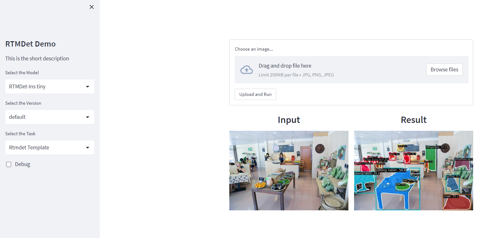

# Simple web demo for RTMDet

A simple live demo build with pinferencia.

The program will automatically download the checkpoint files.

## Getting started

1. configure model task and size in main.py
2. start server

    ```bash
    pinfer main:service --frontend-script=custom_frontend.py
    ```
3. Open browser http://localhost:8501

Other configuration please check pinferencia document and streamlit document.

## Screenshot



## TODO

- [ ] Draw bbox or segm in web.

# Dependency

```
MMDet>=3.0.0rc5
MMRotate>=1.0.0rc1
MMEngine>=0.4.0
MMCV>=2.0.0rc3
streamlit
pinferencia
```
